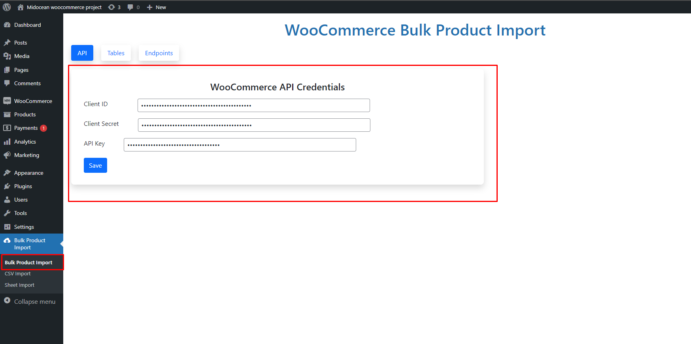
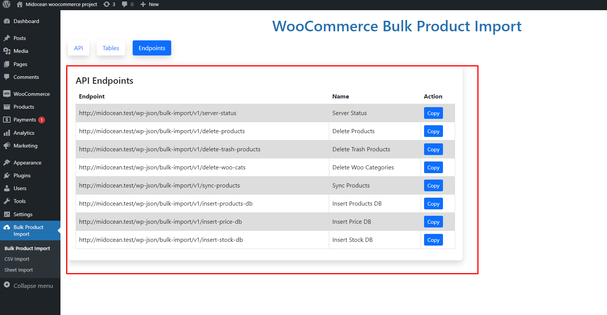

# Midocean Bulk Product Import

## How to use

1. Download and Install the plugin
2. Activate the plugin

3. Generate consumer key and consumer secret key from WooCommerce and save it.
4. Save live api key.
5. Insert Products, Stocks, Prices to DB from API.
    
    - copy endpoints from endpoints tab and execute them.
6. Sync Products from DB to WooCommerce.
